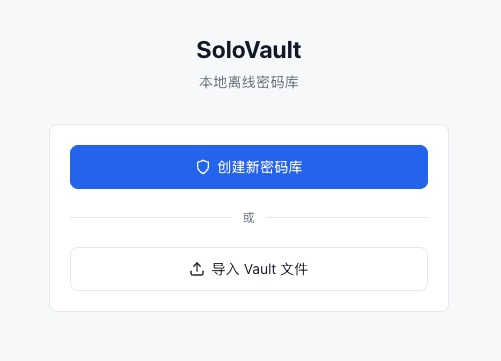
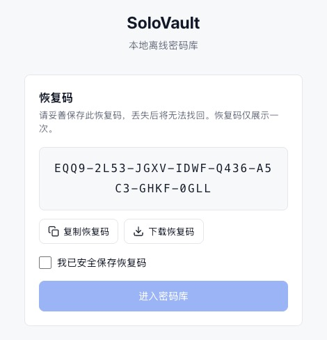
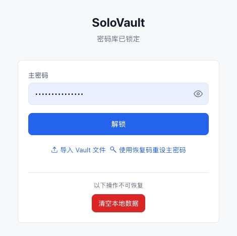
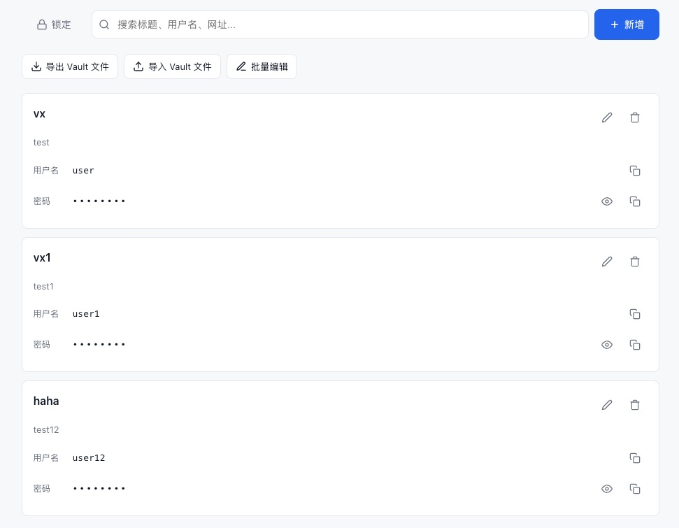
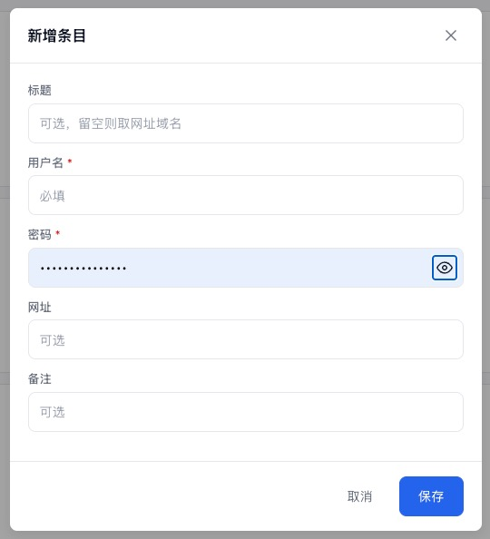
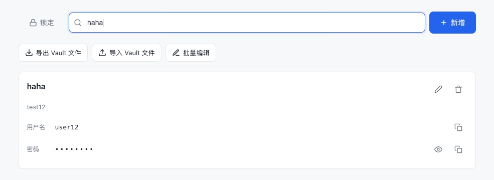
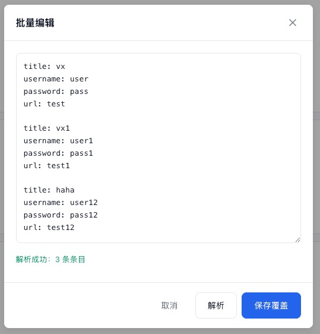
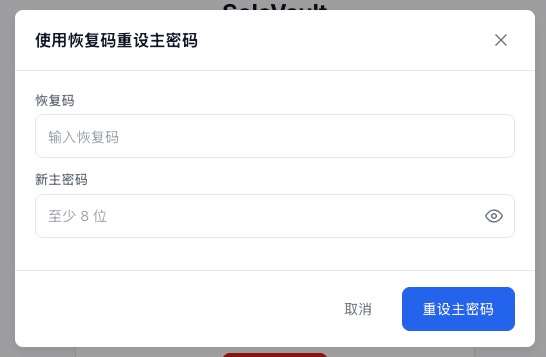

# SoloVault

轻量级、完全离线、零服务端的个人密码管理器。所有数据加密存储在本地浏览器，无需注册、无需云端，你的密码只属于你。

[demo地址](https://lanvendar.github.io/SoloVault "SoloVault")

## 部署

SoloVault 是纯静态 PWA，只需把文件放到任何 Web 服务器上即可。**Web Crypto API 要求 HTTPS 或 localhost**，因此不能直接用 `file://` 打开。

### 方式一：本地快速启动

```bash
cd SoloVault
python3 -m http.server 8080
```

浏览器打开 `http://localhost:8080`，首次访问后 PWA 缓存生效，后续断网也能用。

### 方式二：Nginx

```nginx
server {
    listen 443 ssl;
    server_name vault.example.com;

    ssl_certificate     /path/to/cert.pem;
    ssl_certificate_key /path/to/key.pem;

    root /var/www/solovault;
    index index.html;

    location / {
        try_files $uri $uri/ /index.html;
    }

    location ~* \.(js|css|json|html)$ {
        add_header Cache-Control "no-cache";
    }
}
```

把项目文件复制到 `/var/www/solovault/`，重启 Nginx 即可。

### 方式三：Caddy（自动 HTTPS）

```Caddyfile
vault.example.com {
    root * /var/www/solovault
    file_server
}
```

Caddy 自动申请 Let's Encrypt 证书，零配置 HTTPS。

### 方式四：GitHub Pages

1. 把代码推到 GitHub 仓库
2. Settings → Pages → Source 选 `main` 分支
3. 访问 `https://<username>.github.io/<repo>/`

### 方式五：Vercel / Netlify

直接导入 Git 仓库，框架选「Other」，构建命令留空，输出目录填 `.` 或 `/`。

### 方式六：NAS / 路由器内网

群晖、威联通等 NAS 自带 Web Station，将文件放入共享文件夹映射为虚拟主机即可。OpenWrt 路由器安装 `luci-nginx` 后放入 `/www/solovault/`。

> **关键**：无论哪种方式，首次访问后浏览器会缓存所有资源（Service Worker），之后即使服务器关停，已安装 PWA 的设备仍可离线使用。但清空浏览器数据后需要重新从服务器加载。

---

## 使用手册

### 首次使用：创建密码库



1. 打开应用 → 点击「创建新密码库」
2. 输入主密码（≥8 位），页面实时显示强度条
3. 确认主密码 → 点击「创建」（首次创建需几秒钟，PBKDF2 在后台计算）



4. 页面展示 **恢复码** — 点击「复制恢复码」或「下载恢复码」
5. 勾选「我已安全保存恢复码」→ 点击「进入密码库」

### 日常使用：解锁



- 输入主密码 → 按 Enter 或点击「解锁」
- 密码错误：输入框震动，触发退避等待（1s → 2s → 4s → … → 30s 上限）
- 解锁页底部：
  - 「导入 Vault 文件」— 从备份恢复
  - 「使用恢复码重设主密码」— 忘记密码时用
  - 「清空本地数据」— 输入 `WIPE` 确认后彻底删除

### 管理条目



**新增**：右上角「新增」→ 填写标题/用户名/密码/网址/备注 → 保存



**编辑**：卡片右上角铅笔图标 → 修改 → 保存

**删除**：卡片右上角垃圾桶图标 → 二次确认

**复制**：用户名/密码旁的复制图标，30 秒后剪贴板自动清空

**显隐密码**：眼睛图标切换

### 搜索



顶部搜索框，实时匹配标题、用户名、网址。

### 批量文本编辑



适合从其他密码管理器迁移或批量修改：

1. 工具栏「批量编辑」
2. `key: value` 格式，空行分隔条目：
   ```
   title: 微博
   username: user@email.com
   password: my_password
   url: https://weibo.com
   note: 备用账号

   title: 豆瓣
   username: user2
   password: pass2
   ```
3. 点击「解析」→ 预览结果 → 「保存覆盖」（二次确认）

> ⚠️ 保存覆盖会替换所有现有条目，请先导出备份。

支持字段：`title`、`username`（必填）、`password`（必填）、`url`、`note`、`totpsecret`

值中含冒号不受影响（首冒号分割），如 `url: https://example.com:8080`。

### 导出 / 导入

**导出**：工具栏「导出 Vault 文件」→ 浏览器下载 `solovault-backup-YYYY-MM-DD.vault`

**导入**：工具栏「导入 Vault 文件」→ 选择 `.vault` 文件 → 覆盖确认 → 用该备份的主密码解锁

### 忘记主密码



1. 解锁页 → 「使用恢复码重设主密码」
2. 输入恢复码 + 新主密码（≥8 位）
3. 重设成功后用新密码解锁

### 锁定

- 手动：左上角「锁定」
- 自动：15 分钟无操作 / 页面隐藏超过 5 分钟
- 锁定后内存中的密钥和明文全部清除

### 安装为 PWA

- **iOS Safari**：分享按钮 → 添加到主屏幕
- **Android Chrome**：菜单 → 安装应用
- **桌面 Chrome**：地址栏安装图标 → 安装

安装后全屏运行、离线可用。

---

## 备份策略

SoloVault 的数据安全完全依赖你自己的备份习惯。以下是建议方案：

### 恢复码保存位置

恢复码是忘记主密码时的唯一后门，**仅创建时展示一次**，务必多处保存：

| 保存方式 | 安全性 | 说明 |
|----------|--------|------|
| **手抄在纸上** | ★★★★★ | 放在保险箱或安全抽屉，最抗数字攻击 |
| **打印后锁起来** | ★★★★☆ | 不要放在桌面，打印后删除电子版 |
| **密码管理器** | ★★★☆☆ | 存在另一个密码管理器中（如 Bitwarden），但形成循环依赖 |
| **加密笔记** | ★★★☆☆ | 如 Apple 备忘录加密、1Password 等 |
| **手机备忘录** | ★★☆☆☆ | 不推荐，明文存储风险高 |
| **聊天记录/邮件** | ★☆☆☆☆ | 不推荐，恢复码可能被搜索到 |

> 建议至少保存 2 份，一份纸质、一份电子加密存储。

### .vault 文件备份位置

`.vault` 文件是 AES-256-GCM 全量加密的，即使泄露也无法解密（没有主密码）。因此可以放心存放在各种位置：

| 保存方式 | 便利性 | 说明 |
|----------|--------|------|
| **邮箱附件** | ★★★★☆ | 发给自己一封邮件，附件挂 .vault 文件。搜索方便，随时下载 |
| **云盘** | ★★★★☆ | iCloud / Google Drive / OneDrive / 坚果云等，自动同步多设备 |
| **手机本地文件** | ★★★☆☆ | 下载到手机文件系统，换机时记得迁移 |
| **U 盘 / 移动硬盘** | ★★★☆☆ | 离线存储，不受网络影响，但容易丢失 |
| **NAS** | ★★★☆☆ | 家庭 NAS 定期备份，内网访问 |

> 建议每次修改密码后导出一次，覆盖旧备份。至少保留 1 份异地备份（如邮箱 + 云盘各一份）。

### 跨设备迁移

1. 设备 A：导出 `.vault` 文件 → 通过邮箱/云盘/U 盘传到设备 B
2. 设备 B：打开 SoloVault → 「导入 Vault 文件」→ 选择 `.vault` 文件
3. 输入设备 A 的主密码解锁

> 导入是覆盖操作，设备 B 原有数据会被替换。如需保留，请先导出设备 B 的备份。

---

## 安全参数

```
主密码 ──PBKDF2-SHA256 600K次──▶ K_pw ──AES-GCM Wrap──▶ 信封1 ─┐
                                                                 ├─▶ DEK ──AES-256-GCM──▶ 加密密码库
恢复码 ──PBKDF2-SHA256 600K次──▶ K_rec ──AES-GCM Wrap──▶ 信封2 ─┘
```

| 参数 | 值 |
|------|-----|
| 密钥派生 | PBKDF2-SHA256, 600,000 次迭代 |
| 数据加密 | AES-256-GCM, 12字节IV, 128-bit Tag |
| 密码验证 | AES-GCM 认证标签（解密失败 = 密码错误） |
| 恢复码 | 32字符, 36字符集, 8组短横线分隔 |
| KDF 执行 | Web Worker，不阻塞 UI |
| 剪贴板清空 | 30 秒 |
| 自动锁定 | 15 分钟空闲 / 5 分钟页面隐藏 |
| 解锁退避 | 1s → 2s → 4s → … → 30s 上限 |

## 浏览器兼容性

需支持：Web Crypto API、IndexedDB、Service Worker、Clipboard API、Web Workers

兼容 Chrome 80+、Firefox 80+、Safari 14+、Edge 80+。

## 许可证

MIT
